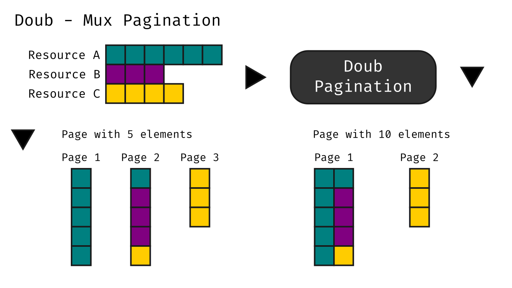

# Doub - Mux Pagination Library

[](https://opensource.org/licenses/Apache-2.0)
[](https://search.maven.org/search?q=g:%22io.github.mariomatheus%22%20AND%20a:%22doub%22)

Doub allows you to build an object pager with different origins.
The main functionality is to provide a common pagination between the objects managed by different processes,
distributing the requisition of resources in an intelligent way.

## Pagination Scheme

<p align="center">
    
</p>

## Installing

1. Add to pom.xml file

```xml
<dependency>
  <groupId>io.github.mariomatheus</groupId>
  <artifactId>doub</artifactId>
  <version>0.0.2</version>
</dependency>
```

2. Install dependency

```sh
mvn install
```

## Using

To build the pagination, it is necessary to provide two resources to the
`Pagination` object through the `put` method, the total number of
elements managed by the process and a function to request these elements
through the `limit` and  `offset` parameters that will be
calculated internally and used as arguments of this function for the data
recovery.

```java
Pagination<FooBar> pagination = new Pagination<>()
    .put(fooTotalElements, (offset, limit) -> repository.findFooByOffsetAndLimit(offset, limit))
    .put(barTotalElements, (offset, limit) -> service.requestBarByOffsetAndLimit(offset, limit));
```

After the construction of the `Pagination` object, the `paginate`
function is used to request the objects in a unified and transparent way.

```java
List<FooBar> content = pagination
    .paginate(0, 10)
    .getContent();
```

## License

See more details in Apache [LICENSE](LICENSE).
